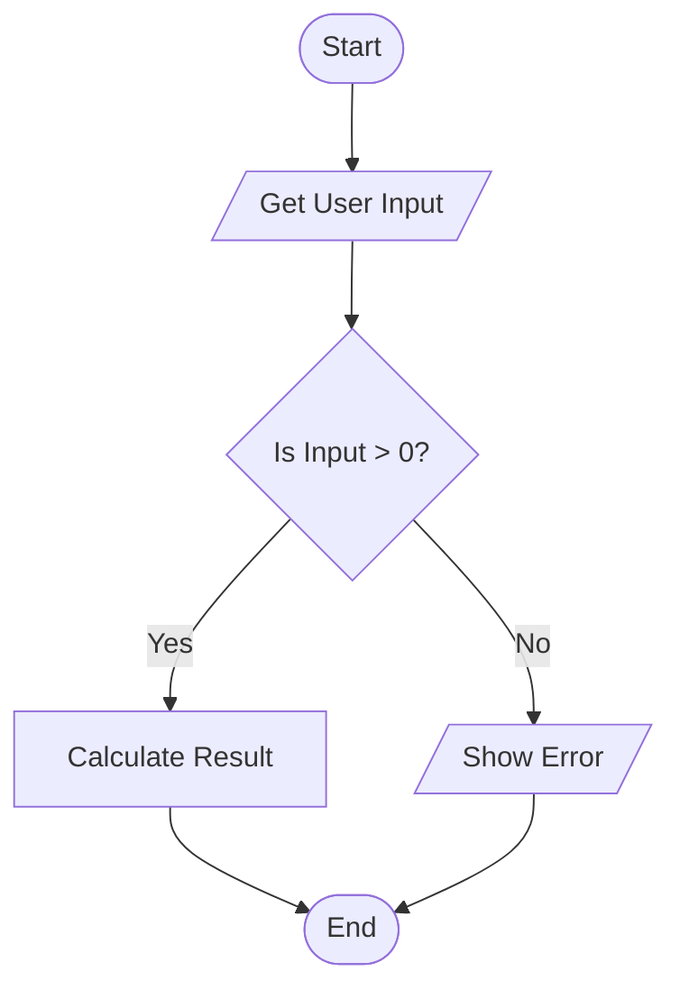

# Module 1: Data types and Flow Chart
## Data Types:
Data types define the type and size of values that can be stored in a variable. Every variable must be declared with a 
specific type before it can be used.
### 1. Primitive Data Types:
These are predefined:

| Type    | Size    | Description              | Range                             |
|---------|---------|--------------------------|-----------------------------------|
| byte    | 1 byte  | 8-bit signed integer     | -128 to 127                       |
| short   | 2 bytes | 16-bit signed integer    | -32768 to 32767                   |
| int     | 4 bytes | 32-bit signed integer    | -2,147,483,648 to 2,147,483,647   |
| long    | 8 bytes | 64-bit signed integer    | -9 quintillion to 9 quintillion   |
| float   | 4 bytes | 32-bit single-precision  | ~7 decimal digits                 |
| double  | 8 bytes | 64-bit double-precision  | ~15 decimal digits                |
| char    | 2 bytes | 16-bit Unicode character | '\u0000' (0) to '\uffff' (65,535) |
| boolean | varies  | 1-bit logical value      | true or false                     |

* #### Note: For long literals, append an L(e.g., 1000L). For float literals, append an f(e.g., 3.14f)

### 2. Non-Primitive (Reference) Data Types:
They refer to objects rather than storing values directly. They are created by the programmer (except for String) and 
can be used to call methods.
* **Strings :** Represents a sequence of characters.
* **Arrays :** Collections of similar data types.
* **Classes :** Blue prints for creating objects.
* **Interfaces :** Abstract types that define a contract for classes.

## Flow Chart:
A **Flow Chart** is a visual diagram that represents a process, or algorithm

#### Common Symbols used:
* **Oval (Terminator):** Indicates the Start or End of the program.
* **Rectangle (Process):** Represents an operation or task, such as a mathematical calculation or data assignment.
* **Parallelogram (Input/Output):** Represents data entering or leaving the system (e.g., "Read user input" or "Print Result").
* **Diamond (Decision):** Represents a conditional point (like an if statement) where the flow branches based on a Yes/No or True/False answer.
* **Arrows (Flow Line):** Shows the direction of the process flow and connects the other symbols.

#### Key Elements of the Flowchart Syntax
* **Direction:** TD or TB (Top Down), BT (Bottom to Top), LR (Left to Right), and RL (Right to Left).
Shapes:
* **([Stadium]):** Starting or ending points.
* **[Rectangle]:** Standard processing steps.
* **{Diamond}:** Decision points.
* **[/Parallelogram/] or [\Parallelogram\]:** Data input/output.
* **[(Cylinder)]:** Databases.
##### Connections:
* **-->:** Solid line with arrow.
* **---:** Solid line without arrow.
* **-.->:** Dotted line with arrow.
* **==>:** Thick line with arrow.

**Labels on Lines:** Use -- text --> or -->|text| to add labels to specific paths.

